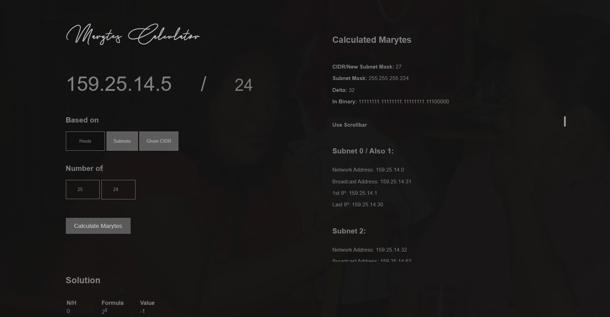

# CIDR/Subnet/Host Calculator
https://jerson.studio/marytes

*Old project - Uploading for archiving purposes*

    $("#hosts-input").click(function() {
        $("#host").prop("disabled", false);
        $("#host").css("opacity", 1);
        $("#host").css("display", "inline-block");
        $("#subnet").css("display", "inline-block");
        $("#numof").css("display", "block");
    })
    $("#subnet-input").click(function() {
        $("#host").css("display", "none");
        $("#numof").css("display", "block");
        $("#subnet").css("display", "inline-block");
    });
    $("#cidr-input").click(function() {
        $("#host").css("display", "none");
        $("#numof").css("display", "none");
        $("#subnet").css("display", "none");
    });
    
    $("#ip").keypress(function() {
        if ($("#subnet-input").is(':checked')) {
            var IP = document.getElementById("ip").value;
            var Split = IP.split(".");
            var first_octet = Split[0];
            var second_octet = Split[1];
            var third_octet = Split[2];
            var fourth_octet = Split[3];
            if (first_octet || first_octet == 0) {
                if (first_octet >= 1 && first_octet <= 126 && fourth_octet >= 0 && fourth_octet <= 255) {
                    $('#cidr').val("8");
                } else if (first_octet >= 128 && first_octet <= 191 && fourth_octet >= 0 && fourth_octet <= 255) {
                    $('#cidr').val("16");
                } else if (first_octet >= 192 && first_octet <= 223 && fourth_octet >= 0 && fourth_octet <= 255) {
                    $('#cidr').val("24");
                }
            }
        }
    });
    
    
    $("#calculate").click(function(e) {
    
        var subnet_num = document.getElementById("subnet").value;
        var ip_input = document.getElementById("ip").value;
        var hosts_num = document.getElementById("host").value;
        var tester = ip_input.split(".");
        var selected;
        if (tester.length == 4 && tester[3] != "") {
    
    
            if ($("#subnet-input").is(':checked')) {
                if (subnet_num.length)
                    calculate(ip_input, "subnet", 0, parseInt(subnet_num));
                else return;
            } else if ($("#hosts-input").is(':checked')) {
                if (subnet_num.length && hosts_num.length)
                    calculate(ip_input, "hosts", parseInt(hosts_num), parseInt(subnet_num));
                else return;
            } else if ($("#cidr-input").is(':checked')) {
                if (document.getElementById("cidr").value.length)
                    calculate(ip_input, "cidr", document.getElementById("cidr").value, 1);
                else return;
            }
            $("#output").css("display", "block");
            $("#ip_ctr").css("opacity", "0");
            setTimeout(function() {
                $("#ip_ctr").addClass("activated");
            }, 500);
            setTimeout(function() {
                $("#output_container").css("opacity", "1");
            }, 1000);
        } else {
    
        }
    });
    
    
    function calculate(IP, selected, num_hosts, num_subnets) {
    
        $("#output").html("");
        $("#additional").html("");
        var octet, first_IP, last_ip, broadcast_add, first_octet, third_octet, fourth_octet, network_add, subnet = null,
            CIDR = null;
    
        var Split = IP.split(".");
        var first_octet = Split[0];
    
        var second_octet = Split[1];
        var third_octet = Split[2];
        var fourth_octet = Split[3];
    
        first_octet = parseInt(Split[0]);
        second_octet = parseInt(Split[1]);
        third_octet = parseInt(Split[2]);
        fourth_octet = parseInt(Split[3]);
        var class_type;
    
        if (first_octet >= 1 && first_octet <= 126 && fourth_octet >= 0 && fourth_octet <= 255) {
            CIDR = 8;
            subnet = "255.0.0.0";
            class_type = "A";
        } else if (first_octet >= 128 && first_octet <= 191 && fourth_octet >= 0 && fourth_octet <= 255) {
            CIDR = 16;
            class_type = "B";
            subnet = "255.255.0.0";
        } else if (first_octet >= 192 && first_octet <= 223 && fourth_octet >= 0 && fourth_octet <= 255) {
            CIDR = 24;
            subnet = "255.255.255.0";
            class_type = "C";
        }
    
        var i = 0;
        if (selected != "hosts") {
            for (i = 0; i < 32; i++) {
                var x = Math.pow(2, i);
                if (x >= num_subnets)
                    break;
            }
            var new_subnet = CIDR + i;
        } else {
            var x;
            for (i = 0; i < 32; i++) {
                x = Math.pow(2, i);
                if ((x - 2) >= num_hosts)
                    break;
                subnet = "";
            }
            var new_subnet = 32 - i;
        }
    
    
        $("#solution").html("");
    
    
        if (selected == "hosts" || selected == "subnet") {
            $("#solution").html(" <h2 style='color:gray' id='solt'>Solution</h2> <table id='tab' style='width:15%;'></table>");
            $("<tr><th>N/H</th><th>Formula</th><th>Value</th></tr>").appendTo("#tab");
        }
        for (u = 0; u <= i; u++) {
    
            if (selected == "hosts") {
                if (u == i) {
                    $("<tr class='highlight'><td>" + u + "</td><td>2" + u + "</td><td>" + (Math.pow(2, u) - 2) + "</td></tr>").appendTo("#tab");
                } else if (u == i - 1) {
                    $("<tr><td>...</td><td>...</td><td>...</td></tr>").appendTo("#tab");
                    $("<tr><td>" + u + "</td><td>2" + u + "</td><td>" + (Math.pow(2, u) - 2) + "</td></tr>").appendTo("#tab");
                } else if (u <= 3) {
                    $("<tr><td>" + u + "</td><td>2" + u + "</td><td>" + (Math.pow(2, u) - 2) + "</td></tr>").appendTo("#tab");
                }
            } else if (selected == "subnet") {
                if (u == i) {
                    $("<tr class='highlight'><td>" + u + "</td><td>2" + u + "</td><td>" + (Math.pow(2, u)) + "</td></tr>").appendTo("#tab");
                } else if (u == i - 1) {
                    $("<tr><td>...</td><td>...</td><td>...</td></tr>").appendTo("#tab");
                    $("<tr><td>" + u + "</td><td>2" + u + "</td><td>" + (Math.pow(2, u)) + "</td></tr>").appendTo("#tab");
                } else if (u <= 3) {
                    $("<tr><td>" + u + "</td><td>2" + u + "</td><td>" + (Math.pow(2, u)) + "</td></tr>").appendTo("#tab");
                }
            }
        }
    
        if (selected == "hosts") {
            $(" 
NSM = 32 - H

H = 2N-2 ≥ HOSTS

NSM = 32 - " + (u - 1) + "

NSM = " + (32 - (u - 1)) + "
 ").insertAfter("#tab");
        } else if (selected == "subnet") {
            $(" 
DSM = CLASS SUBNET

Class A = 8, Class B=16, Class C=24
 
NSM = DSM + N

N = 2N ≥ SUBNET

NSM = " + CIDR + " + " + (u - 1) + "

NSM = " + (CIDR + (u - 1)) + "
 ").insertAfter("#tab");
        }
    
        $(" 
").insertAfter("#tab");
    
        if (selected == "cidr") {
            new_subnet = num_hosts;
        }
    
        var delta = Math.pow(2, (8 - (new_subnet % 8)));
        var subnet_whole = Math.ceil(new_subnet / 8);
        var subnet_min = Math.floor(new_subnet / 8);
        var binary = "";
    
        var counter = 0;
    
        for (var i = 0; i < new_subnet % 8; i++) {
            binary += "1";
            counter++;
        }
        for (var i = 0; i < (8 - (new_subnet % 8)); i++) {
            binary += "0";
        }
        var subnet_binary = "";
    
        var counter = 1;
    
        if (selected == "hosts" || selected == "subnet") {
            subnet = "";
            for (var r = 0; r < subnet_min; r++) {
                subnet += "255.";
                subnet_binary += "11111111.";
                counter++;
            }
            subnet += parseInt(binary, 2);
            subnet_binary += binary;
            for (var r = 0; r < (4 - counter); r++) {
                subnet += ".0";
                subnet_binary += ".00000000";
            }
    
        }
    
    
        var numbers = [first_octet, second_octet, third_octet, fourth_octet];
        var runs = 0;
    
        $("
<b>Use Scrollbar
 ").appendTo("#output");
    
        for (var i = 1; i <= num_subnets; i++) {
    
            var init = delta * i;
    
            var lastip;
    
            lastip = (delta * i) % 256;
            if ((delta * i) % 256 == 0 && i > 0) {
                lastip = delta * 2;
            }
            lastip--;
    
            if ((delta * i) % 256 == 0 && delta * i >= 256) {
                if ((delta * (i - 1)) % 256) {
                    lastip = 255;
                } else {
                    lastip = (((delta * (i)) / 256) * delta) - 1;
                }
            } else if ((delta * i) % 256 != 0) {
                lastip = (delta * i) % 256 - 1;
            }
    
            if (delta == 256) {
                lastip = delta - 1;
            }
    
    
            switch (subnet_whole) {
                case 1: {
    
                    numbers[0] = (delta * (i - 1)) % 256;
                    numbers[1] = 0;
                    numbers[2] = 0;
                    numbers[3] = 0;
    
                    network_add = numbers[0] + "." + numbers[1] + "." + numbers[2] + "." + numbers[3];
                    first_IP = numbers[0] + "." + numbers[1] + "." + numbers[2] + "." + 1;
                    last_ip = lastip + "." + 255 + "." + 255 + "." + 254;
                    broadcast_add = lastip + "." + 255 + "." + 255 + "." + 255;
    
                    break;
                }
                case 2: {
    
                    numbers[1] = (delta * (i - 1)) % 256;
                    numbers[2] = 0;
                    numbers[3] = 0;
    
                    network_add = numbers[0] + "." + numbers[1] + "." + numbers[2] + "." + numbers[3];
                    first_IP = numbers[0] + "." + numbers[1] + "." + numbers[2] + "." + 1;
                    last_ip = numbers[0] + "." + lastip + "." + 255 + "." + 254;
                    broadcast_add = numbers[0] + "." + lastip + "." + 255 + "." + 255;
    
                    numbers[0] = Math.floor((delta * (i)) / 255) + first_octet;
    
                    break;
                }
                case 3: {
    
                    numbers[2] = (delta * (i - 1)) % 256;
    
                    if (numbers[1] >= 256) {
                        numbers[0] += 1;
                        numbers[1] = 0;
                    }
                    numbers[3] = 0;
    
                    network_add = numbers[0] + "." + numbers[1] + "." + numbers[2] + "." + numbers[3];
                    first_IP = numbers[0] + "." + numbers[1] + "." + numbers[2] + "." + 1;
                    last_ip = numbers[0] + "." + numbers[1] + "." + lastip + "." + 254;
                    broadcast_add = numbers[0] + "." + numbers[1] + "." + lastip + "." + 255;
    
                    numbers[1] = Math.floor((delta * (i)) / 255) + second_octet;
    
                    break;
                }
                case 4: {
    
                    numbers[3] = (delta * (i - 1)) % 256;
    
                    if (numbers[2] >= 256) {
                        numbers[1] += 1;
                        numbers[2] = 0;
                    }
    
                    if (numbers[1] >= 256) {
                        numbers[0] += 1;
                        numbers[1] = 0;
                    }
    
                    network_add = numbers[0] + "." + numbers[1] + "." + numbers[2] + "." + numbers[3];
                    first_IP = numbers[0] + "." + numbers[1] + "." + numbers[2] + "." + (numbers[3] + 1);
    
                    broadcast_add = numbers[0] + "." + numbers[1] + "." + numbers[2] + "." + lastip;
                    last_ip = numbers[0] + "." + numbers[1] + "." + numbers[2] + "." + (lastip - 1);
    
                    numbers[2] = Math.floor((delta * (i)) / 255) + third_octet;
    
                    break;
                }
            }
    
            var subnet_ref = i;
            if (i == 1) {
                subnet_ref = "0 / Also 1";
            }
            var append = "<h3>Subnet " + subnet_ref + ": </h3>

Network Address: " + network_add + "

Broadcast Address: " + broadcast_add + "
1st IP: " + first_IP + "
" + "
Last IP: " + last_ip + "
" + "
 ";
            $(append).appendTo("#output");
        }
        var additional = "<h2>Calculated Marytes</h2> <b>
CIDR/New Subnet Mask:</b> " + new_subnet + "
<b>
Subnet Mask:</b> " + subnet + "
<b>
Delta:</b> " + delta + "

<b>In Binary:</b> " + subnet_binary + "
";
        $(additional).appendTo("#additional");
    
        if (selected == "subnet") {
            $("
<b>Class:</b> " + class_type + "
").appendTo("#additional");
        }
    
        $(" ").appendTo("#additional");
    
        numbers[0] = 0;
        numbers[2] = 0;
        numbers[3] = 0;
        numbers[4] = 0;
        numbers[0] = 0;
        last_ip = 0;
        init = 0;
    }
